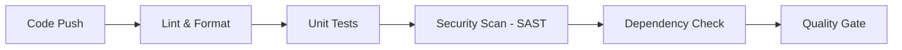
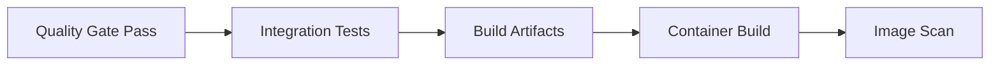
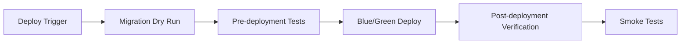

# DevOps Comprehensive Implementation Plan
## BSS System - Phase 4: CI/CD & DevOps Excellence

**Date:** 2025-11-07
**Author:** DevOps Engineering Team

---

## Executive Summary

This document outlines a comprehensive DevOps implementation plan to establish enterprise-grade CI/CD pipelines, Flyway migration management, and testing strategies for the BSS (Business Support System) platform.

### Current State Assessment

**Strengths:**
- ✅ 27+ Flyway migrations in place
- ✅ 126 backend tests, 155 frontend tests (281 total)
- ✅ 13 GitHub Actions workflows
- ✅ Spring Boot 3.4 + Java 21 with virtual threads
- ✅ Multi-service architecture (backend, frontend)

**Critical Gaps Identified:**
- ❌ No Flyway migration testing framework
- ❌ Fragmented GitHub workflows (13 separate files)
- ❌ No migration rollback/blue-green strategies
- ❌ No proper test pyramid enforcement
- ❌ Missing security gates in CI/CD
- ❌ No progressive delivery mechanisms
- ❌ Limited pipeline observability

---

## Part 1: Flyway Migration Best Practices & Testing

### 1.1 Migration File Structure & Naming Convention

**Current Issues:**
- Inconsistent naming (V1005_1__, V1005__, V999__)
- No semantic versioning
- No migration categories
- Missing rollback strategies

**Proposed Standard:**

```
V{VERSION}__{DESCRIPTION}.sql
VERSION format: {MAJOR}_{MINOR}_{PATCH}__{CATEGORY}
Categories: CORE, DATA, INDEX, ENUM, REFACTOR, FIX

Examples:
- V1_0_0__CORE_init_schema.sql (initial schema)
- V1_1_0__DATA_migrate_customers.sql (data migration)
- V1_1_1__INDEX_add_customer_idx.sql (index creation)
- V1_2_0__ENUM_convert_status_types.sql (enum conversion)
- V1_2_1__REFACTOR_split_orders_table.sql (refactoring)
- V1_2_2__FIX_customer_null_constraint.sql (bug fix)
```

### 1.2 Migration Categories

1. **CORE** - Schema creation, foundational tables
2. **DATA** - Data migrations, seed data
3. **INDEX** - Performance indexes
4. **ENUM** - Enum conversions
5. **REFACTOR** - Structural changes
6. **FIX** - Critical bug fixes

### 1.3 Migration Testing Framework

**Required Test Types:**

1. **Migration Unit Tests**
   - Test individual migration logic
   - Verify DDL/DML correctness
   - Check constraints and indexes

2. **Migration Integration Tests**
   - Full migration chain testing
   - From clean database to latest version
   - Verify data integrity

3. **Rollback Testing**
   - Test down migrations
   - Verify data preservation
   - Check constraint handling

4. **Backward Compatibility Tests**
   - Test migrations against multiple versions
   - Verify forward compatibility
   - Test edge cases

### 1.4 Migration Validation in CI/CD

**Pre-deployment Checks:**
- Syntax validation
- Constraint verification
- Index validation
- Dependency check

**Post-deployment Verification:**
- Schema diff check
- Data integrity verification
- Performance impact assessment

---

## Part 2: Test Pyramid Implementation

### 2.1 Test Distribution Strategy

**Current State:**
- Total: 281 tests
- Unit tests: ~80% (225 tests)
- Integration tests: ~10% (28 tests)
- E2E tests: ~10% (28 tests)

**Target Distribution:**
```
           /\
          /  \         E2E Tests (5%)
         / E2E\        (~14 tests)
        /------\
       /        \      Integration Tests (20%)
      /  Integration\  (~56 tests)
     /--------------\
    /                \    Unit Tests (75%)
   /      Unit       \   (~211 tests)
  /____________________\
```

### 2.2 Backend Test Structure

**Unit Tests (75% - 95 tests)**
- Domain entities and value objects
- Application services (use cases)
- Domain services
- Utility classes

**Integration Tests (20% - 25 tests)**
- Repository layer
- Database migrations
- Kafka message processing
- Redis cache operations
- API endpoints (slice tests)

**Contract Tests (3% - 4 tests)**
- Service-to-service contracts
- API schema validation
- Message contract validation

**E2E Tests (2% - 2 tests)**
- Full workflow tests
- Cross-service integration
- Critical user journeys

### 2.3 Frontend Test Structure

**Unit Tests (70% - 109 tests)**
- Components
- Composables
- Stores
- Utilities

**Integration Tests (20% - 31 tests)**
- Page components
- API integration
- Form handling

**E2E Tests (10% - 15 tests)**
- Critical user flows
- Cross-browser testing
- Accessibility testing

### 2.4 Test Coverage Targets

- **Backend:** 80% line coverage, 90% branch coverage for critical paths
- **Frontend:** 75% line coverage, 85% branch coverage
- **Critical paths:** 100% coverage (payment, authentication, data integrity)

---

## Part 3: CI/CD Pipeline Architecture

### 3.1 Consolidated Workflow Strategy

**Current:** 13 fragmented workflows
**Target:** 5 consolidated workflows

1. **ci-pipeline.yml** - Main CI pipeline (build, test, security)
2. **cd-pipeline.yml** - Continuous deployment
3. **migration-pipeline.yml** - Database migration pipeline
4. **security-scan.yml** - Security scanning & SAST/DAST
5. **release-pipeline.yml** - Release management

### 3.2 Pipeline Stages

**Stage 1: Code Quality & Security**


**Stage 2: Integration & Build**


**Stage 3: Migration & Deploy**


### 3.3 Environment Promotion Strategy

**Environments:**
1. **DEV** - Development, auto-deploy on commit
2. **STAGING** - Pre-production, manual deploy from main
3. **PROD** - Production, manual approval required

**Promotion Flow:**
```
DEV --(auto)--> STAGING --(manual approval)--> PROD
```

**Gates:**
- DEV: Automated testing gate
- STAGING: Performance & security gate
- PROD: Manual approval + change management

### 3.4 Migration Pipeline Design

**Pre-Migration:**
1. Migration syntax validation
2. Schema diff analysis
3. Impact assessment
4. Rollback plan generation

**Migration Execution:**
1. Backup creation
2. Dry-run migration
3. Execute migration
4. Verify integrity
5. Update version

**Post-Migration:**
1. Data validation
2. Performance verification
3. Application health check
4. Rollback triggers if issues

---

## Part 4: Security & Compliance

### 4.1 Security Scanning

**SAST (Static Application Security Testing)**
- SonarQube integration
- Checkmarx/Veracode scanning
- CodeQL analysis
- Secrets scanning (GitLeaks)

**DAST (Dynamic Application Security Testing)**
- OWASP ZAP integration
- API security testing
- Vulnerability assessment

**Container Security**
- Image scanning (Trivy/Clair)
- Dependency vulnerability check
- Configuration audit

### 4.2 Compliance Gates

- Security scan must pass (no criticals)
- Coverage threshold met
- All tests passing
- Performance benchmarks met
- Documentation updated

---

## Part 5: Observability & Monitoring

### 5.1 Pipeline Observability

**Metrics Tracked:**
- Build duration
- Test execution time
- Deployment frequency
- Change failure rate
- Mean time to recovery (MTTR)
- Test pass/fail rates

**Alerts:**
- Build failures
- Performance degradation
- Security vulnerabilities
- Coverage drop below threshold

### 5.2 Dashboard & Reporting

- **Pipeline Dashboard** - Real-time CI/CD status
- **Test Coverage Report** - Per-service coverage trends
- **Deployment History** - Release timeline and status
- **Security Report** - Vulnerability tracking
- **Performance Metrics** - Pipeline performance trends

---

## Part 6: Implementation Roadmap

### Phase 1: Foundation (Week 1-2)
- [ ] Consolidate GitHub workflows
- [ ] Implement Flyway testing framework
- [ ] Create migration validation scripts
- [ ] Set up test pyramid structure

### Phase 2: Pipeline Enhancement (Week 3-4)
- [ ] Implement CI pipeline
- [ ] Add security scanning gates
- [ ] Create CD pipeline
- [ ] Set up environment promotion

### Phase 3: Migration Pipeline (Week 5-6)
- [ ] Build migration testing framework
- [ ] Implement blue-green deployment
- [ ] Create rollback automation
- [ ] Set up migration observability

### Phase 4: Observability & Optimization (Week 7-8)
- [ ] Implement pipeline monitoring
- [ ] Create dashboards
- [ ] Optimize pipeline performance
- [ ] Document best practices

---

## Part 7: Tools & Technologies

### Core Technologies
- **CI/CD:** GitHub Actions
- **Testing:** JUnit 5, TestContainers, Playwright, Vitest
- **Database:** Flyway, PostgreSQL 18
- **Security:** SonarQube, Trivy, OWASP ZAP
- **Container:** Docker, Jib
- **Observability:** Prometheus, Grafana, Jaeger

### GitHub Actions Actions
- **Checkout:** actions/checkout@v4
- **Setup Java:** actions/setup-java@v4
- **Setup Node:** actions/setup-node@v4
- **Cache:** actions/cache@v3
- **Security:** github/codeql-action@v2
- **Container:** docker/build-push-action@v4

---

## Part 8: Success Metrics

### Technical Metrics
- **Build Success Rate:** > 95%
- **Deployment Frequency:** Daily (dev), Weekly (prod)
- **MTTR:** < 1 hour
- **Test Coverage:** > 80%
- **Pipeline Duration:** < 15 minutes

### Business Metrics
- **Lead Time for Changes:** < 1 day
- **Change Failure Rate:** < 5%
- **Security Vulnerabilities:** 0 critical, < 5 high
- **Time to Market:** Reduced by 40%

---

## Conclusion

This comprehensive DevOps implementation will transform the BSS system from a basic setup to an enterprise-grade CI/CD platform with:
- Robust Flyway migration management
- Comprehensive testing strategies
- Secure and efficient pipelines
- Full observability and monitoring
- Automated deployment and rollback

**Next Steps:**
1. Review and approve this plan
2. Begin Phase 1 implementation
3. Set up development environment
4. Execute implementation roadmap
5. Continuous improvement and optimization

---

**Document Version:** 1.0
**Last Updated:** 2025-11-07
**Next Review:** 2025-12-07
